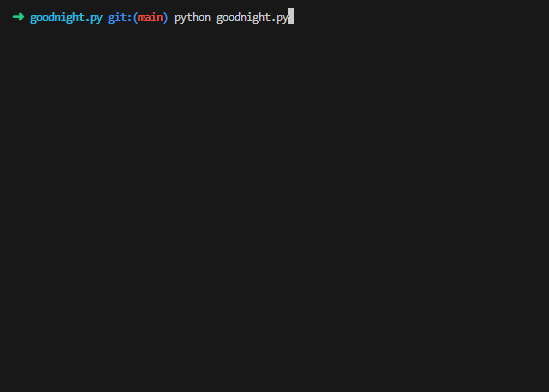

<div align="center" id="top">
    <h1 markdown="1">:crescent_moon: goodnight.py :crescent_moon:</h1>
</div>

<div align="center">
    <a href="#full_moon_with_face-description">Description</a> &#xa0; | &#xa0;
    <a href="#city_sunset-usage">Usage</a> &#xa0; | &#xa0;
    <a href="#paperclips-compatability">Compatability</a> &#xa0; | &#xa0;
    <a href="#card_file_box-project-log">Change log</a>
</div>
&#xa0;
<div align="center">
    
    <a href="#card_file_box-project-log"></a>
    <a href="https://github.com/QuentindiMeo/goodnight.py/commits/main"></a>
    
    <!--  -->
</div>
<div align="center">
    <a href="https://github.com/QuentindiMeo/goodnight.py/stargazers"></a>
    <a href="https://github.com/QuentindiMeo/goodnight.py/issues"></a>
    <a href="https://github.com/QuentindiMeo/goodnight.py/graphs/contributors"></a>
    
</div>
&#xa0;
<div align="center" width="75%">
    <abbr title="Demonstration v0.2.0"></abbr>
</div>
<div align="center">
    <a href="https://www.paypal.com/cgi-bin/webscr?cmd=_s-xclick&hosted_button_id=Z9V98YGZMK8CU">
        
    </a>
</div>
&#xa0;

## :full_moon_with_face: Description

No need to think about not being repetitive in the way you say "Good night" any more!  
Just run this script and it will generate a random goodnight message for your loved one.  
The author of this script declines all responsibility for any conflict caused by the (over)use of this script. :wink:

## :city_sunset: Usage

&nbsp;&nbsp; :checkered_flag:&nbsp; **Launch**

``` bash
python goodnight.py [OPTIONS]
```

&#xa0;

&nbsp;&nbsp; :hammer_and_wrench:&nbsp; **Options**

``` txt
-b, --bounds     (x,y)  Bounds for the random range of how many phrases to draw (def: 2,5)
-n, --nb-phrases <int>  Number of phrases to draw
-e, --emoji             Add emoji after each phrase (def: False)
-s, --source     <str>  Source file to pull contents (phrases...) from (def: ./assets/source.log)
-w, --for-whom   <str>  For whom the goodnight is (def: "" (no name used))
-r, --allow-repetition  Allow repetition of phrases if nbPhrases is higher than the phrases in the source file (def: False)
--verbose               Toggle verbose mode (def: False)

--default               Launch once with default values (ignores other parameters) (def: False)
-i, --ignore            Ignore preferences (preferences.sav file) (def: False)
--isave                 ... but save preferences regardless (def: False)

-h, --help              Display this help and exit
```

&#xa0;

&nbsp;&nbsp; :hotsprings:&nbsp; **Default behavior** / its equivalents

``` bash
python goodnight.py --bounds "2,5" --source "./assets/source.log" --for-whom ""
python goodnight.py -b "2,5" -s "./assets/source.log" -w ""
python goodnight.py --default
```

&#xa0;

&nbsp;&nbsp; :bookmark_tabs:&nbsp; **General Information**

- Your preferences are automatically saved upon the first launch unless specified otherwise *(see above: `-i`)*.
- `-b` and `-n` are mutually exclusive. If both are provided, the program will exit with an error.
- A file named [source.log](./assets/source.log) serves as the default source file for phrases, emoji and nicknames.
  - You may create your own source file *(see above: `-s`)*. Open the default source file to see how to format it.
- If nicknames are provided in said source file, they will override the `--for-whom` option.
- As Ctrl+D cannot be caught in this script, you can use Ctrl+C to exit at any time.

## :paperclips: Compatability

This script is written in Python 3.10 and is not backwards compatible with Python 2.x.  
It was tested on and designed for Windows 10 and Ubuntu 22.04.

## :card_file_box: Change log

- ***[DEV 0.0.0]** Oct 30 2023* - Project creation
- ***[DEV 0.0.1]** Oct 30 2023* - Added Parameters class (-new) and first elementary components
- ***[DEV 0.0.2]** Oct 31 2023* - Added parameter handling (- and --), Exit and Help setup
- ***[DEV 0.0.3]** Nov 01 2023* - Added -s (wip), preferences.sav with -D and -i, Ctrl+C handler
- ***[DEV 0.0.4]** Nov 01 2023* - Added sources extractor (phrases, emoji), multioptional parameters handling
- ***[DEV 0.0.5]** Nov 01 2023* - Added nicknames to source extractor; removed -D, added --debug; added Types for clarity
- ***[DEV 0.1.0]** Nov 02 2023* - Added weighting feature to source extractor (Contents class); renamed --debug as --verbose
- ***[DEV 0.1.1]** Nov 03 2023* - Added possibility to set a random range as nbPhrases, added --isave
- ***[DEV 0.1.2]** Nov 04 2023* - Fixed CLI oddities; added warning if high upper bound on range, --default, links on README badges
- ***[DEV 0.1.3]** Nov 05 2023* - Fixed -n/-b oddities; added and implemented --allow-repetition and nickname picking
- ***[DEV 0.1.4]** Nov 05 2023* - Added emoji picking, improved --verbose, fixed missing file extraction case
- ***[DEV 0.1.5]** Nov 05 2023* - Fixed multi-optional param oddity, removed CLI need for parameters set by file extraction
- ***[DEV 0.1.6]** Nov 05 2023* - Fixed usedEmoji malfunction, removed "s surrounding every element
- ***[DEV 0.2.0]** Nov 06 2023* - Added phrase picking, added -r as alias for --allow-repetition, presentation gif
- ***[DEV 0.2.1]** Nov 06 2023* - Adjusted gif, adding nicer transition "and" between phrases
- ***[DEV 0.2.2]** Nov 06 2023* - Added possibility to have several PHRASES (and others) in source file

<br />

[Back to top](#top)
