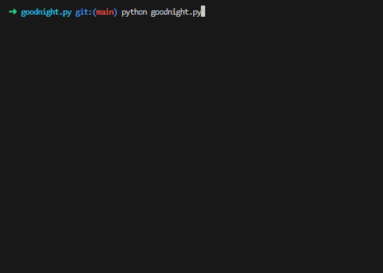

<div align="center" id="top">
    <h1>:crescent_moon: goodnight.py :crescent_moon:</h1>
</div>

<div align="center">
    <a href="#full_moon_with_face-description">Description</a> &#xa0; | &#xa0;
    <a href="#city_sunset-usage">Usage</a> &#xa0; | &#xa0;
    <a href="#gear-requirements">Requirements</a> &#xa0; | &#xa0;
    <a href="#card_file_box-changelog">Changelog</a> &#xa0; | &#xa0;
    <a href="LICENSE.md">License</a>
</div>
&#xa0;
<div align="center">
    <a href="#top"></a>
    <a href="#card_file_box-changelog"></a>
    <a href="https://github.com/QuentindiMeo/goodnight.py/commits/main"></a>
    <a href="#top"></a>
    <!--  -->
    <!--  -->
</div>
<div align="center">
    <a href="https://github.com/QuentindiMeo/goodnight.py/stargazers"></a>
    <a href="https://github.com/QuentindiMeo/goodnight.py/issues"></a>
    <a href="https://github.com/QuentindiMeo/goodnight.py/graphs/contributors"></a>
    <a href="#top"></a>
</div>
&#xa0;
<div align="center" width="75%">
    <a href="#top"><abbr title="Demonstration v0.2.0">
    
    </abbr></a>
</div>
<div align="center">
    <a href="https://www.paypal.com/cgi-bin/webscr?cmd=_s-xclick&hosted_button_id=Z9V98YGZMK8CU">
    
    </a>
</div>
&#xa0;

## :full_moon_with_face: Description

You won't have to worry about the way you say "Good night" any more!  
Just run this script and it will generate a random goodnight message for your loved one.  
The author declines all responsibility for any conflict caused by the (over)use of this script. :wink:

> [!NOTE]
> Don't hesitate and report any kind of malfunction or request a feature by [**opening an issue**](https://github.com/QuentindiMeo/goodnight.py/issues)!  
> Feel free to also check the [code of conduct](CODE_OF_CONDUCT.md) and [contributing guide](CONTRIBUTING.md).

&#xa0;

## :city_sunset: Usage

&nbsp;&nbsp; :rocket:&nbsp; **Launch**

``` bash
make && ./goodnight.py [OPTIONS]
```

&#xa0;

&nbsp;&nbsp; :hammer_and_wrench:&nbsp; **Options**

``` txt
--default               Launch once with default values (ignores other parameters)
--no-copy               Do not copy the result to clipboard

-b, --bounds     (x,y)  Bounds for the random range of how many phrases to draw (def: 2,5)
-n, --nb-phrases <int>  Number of phrases to draw
-e, --emoji             Add emoji after each phrase (from source file)
-s, --source     <str>  Source file to pull contents (phrases...) from (def: ./assets/source.log)
-w, --for-whom   <str>  For whom the goodnight is (def: "" [no name used])
-N, --nick-nth   <int>  Place the nickname after the nth phrase (def: 0 [random placement])

-r, --allow-repetition  Allow repetition of phrases if you ask for more than there are in the source file
-o, --other-step        Use the even-numbered phrase gaps as "and"s instead of commas (def: odd-)
-a, --alternate         Alternate between "and"s, and emoji instead of commas (requires -e)
-t, --times      <int>  Generate and print a given amount of goodnights (def: 1)
-i, --infinite          Toggle infinite mode
-d, --delay      <val>  Add delay after each iteration, in milliseconds (def: 0) | 'p': press Enter to continue
--ignore                Ignore preferences file
-S, --save              Save configuration to preferences file
-p, --pref-file  <str>  Use a specific preferences file (def: preferences.sav)

--verbose               Toggle verbose mode
-h, --help              Display this help and exit
```

&#xa0;

&nbsp;&nbsp; :hotsprings:&nbsp; **Default Behavior** & Equivalents

``` bash
./goodnight.py --bounds=2,5 --source="./assets/source.log" --for-whom="" --pref-file="./assets/preferences.sav"
./goodnight.py -b "2,5" -s "assets/source" -w "" -p "assets/preferences"
./goodnight.py --default
```

&#xa0;

&nbsp;&nbsp; :bookmark_tabs:&nbsp; **General Information**

- Fear not having to copy the result of the program, it will be automatically **copied to your clipboard**! :wink: (unless [`--no-copy`](#city_sunset-usage) is present)
- Your preferences are **automatically saved** upon the first launch unless specified otherwise (see above: [`-i`](#city_sunset-usage)).
  - You can also create a preferences file manually, see above: [`-p`](#city_sunset-usage); Find a tutorial in [default.sav](./assets/default.sav).
  - Settings will be set based on parameters; all unfilled parameters will be based on the preference file; if there are still unfilled parameters, the CLI will ask you for them.
- Though Ctrl+D cannot be caught in this script, you can **use Ctrl+C** to exit at any time.
- [`-b`](#city_sunset-usage) and [`-n`](#city_sunset-usage), just like [`-t`](#city_sunset-usage) and [`-i`](#city_sunset-usage), are mutually exclusive. If both are provided, the program will exit with an error.
- [`-o`](#city_sunset-usage) naturally has no effect if there is only one phrase, or [`-e`](#city_sunset-usage) is present.
- A file named [source.log](./assets/source.log) serves as the default source file for phrases, emoji and nicknames.
  - You may create your own `.log` source file (see above: [`-s`](#city_sunset-usage)). Open [source.log](./assets/source.log) to see how to format your own.
- The [`--for-whom`](#city_sunset-usage) option overrides nicknames provided by a source file.

&#xa0;

## :gear: Requirements

This program was tested on and designed for Ubuntu 22.04; it is WSL2-compatible.  
It uses the **Pyperclip** module to copy its results to your clipboard; you may need to install it with `make install`  
Pyperclip itself uses a clipboard package, which you may need to install as well. Refer to [Pyperclip's documentation](https://pyperclip.readthedocs.io/en/latest/) for more information.

> [!CAUTION]
> **goodnight.py**'s code is written in Python **3.10** and is **not** compatible with anterior versions.

&#xa0;

## :card_file_box: Changelog

Only the major checkpoints of the project will be listed in this paragraph.  
The exhaustive and detailed changelog is available [**here**](CHANGELOG.md).

- ***[DEV 0.0.0]** Oct 30 2023*: Project creation.
- ***[DEV 0.1.0]** Nov 02 2023*: Project comprehends its core components: phrases, emoji, nickname, weighting.
- ***[DEV 0.2.0]** Nov 06 2023*: Project generates goodnights using its core components, added fancy options.
- ***[DEV 0.2.5]** Nov 13 2023*: Code security and quality was improved, new options were added.
- ***[DEV 0.3.0]** Jan 06 2024*: Repo was enhanced, quality was improved, a Makefile and new options were added.

<br />

[Back to top](#top)
